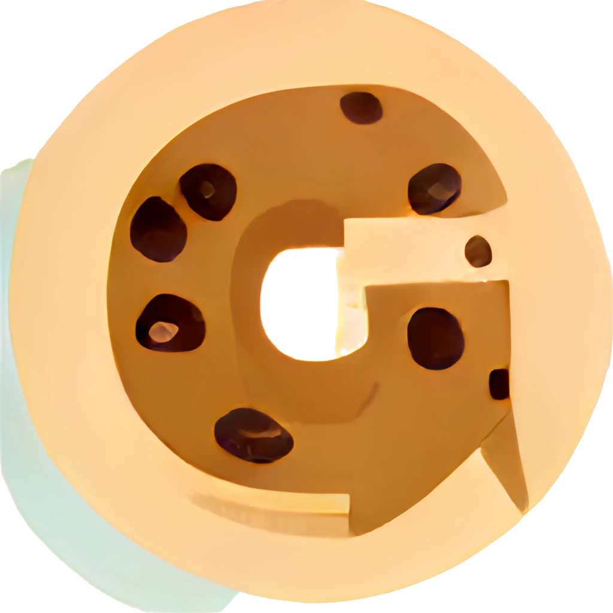

# Matrix-GChat Bridge Login Cookie Generator



Little web extension for [Firefox]() and [Chromium]() based browsers to generate the `login-cookie` command that [mautrix' Google Chat bridge](https://docs.mau.fi/bridges/python/googlechat/index.html) needs for authentication.

## Install

The web extension is available from  [Mozilla's AddOn directory](https://addons.mozilla.org/en-US/firefox/addon/gchat-login-cookie-generator/) and the  [Chrome Web Store](https://chrome.google.com/webstore).

## Why and How?

Since some time the bridge users need to re-authenticate the Google Chat connection with some `login-cookie` command.
For that you'd need to login to the Google Chat with a browser, check the browser's cookies and copy 5 of the Google cookies to a json object like that:

```json
{
  "compass": "dynamite-ui=...",
  "ssid": "...",
  "sid": "...",
  "osid": "...",
  "hsid": "..."
}
```

which must then be sent to the Google Chat bridge bot. 

-> check the [full mautrix authentication manual](https://docs.mau.fi/bridges/python/googlechat/authentication.html)

Anyway, that must be done like every other week and is of course super annoying...

Thus, I wrote that little web extension to automates the process.
Just click the little new icon in the browser's toolbar after you signed in to the Google Chat and it will check the Google cookies and create the necessary json object for you \o/


## Build

Unfortunately, at the moment Firefox basically only supports web extensions version 2 while Chromium already pressures to web extensions version 3.
Fortunately, this web extension is simple enough that those two versions only differ in the manifest format and that's why there are two manifests: [manifest-v2.json](manifest-v2.json) for Firefox and [manifest-v3.json](manifest-v3.json) for Chromium.

To build a new version, just create a link `manifest.json` to one of the manifest version and zip everything into an archive. 
